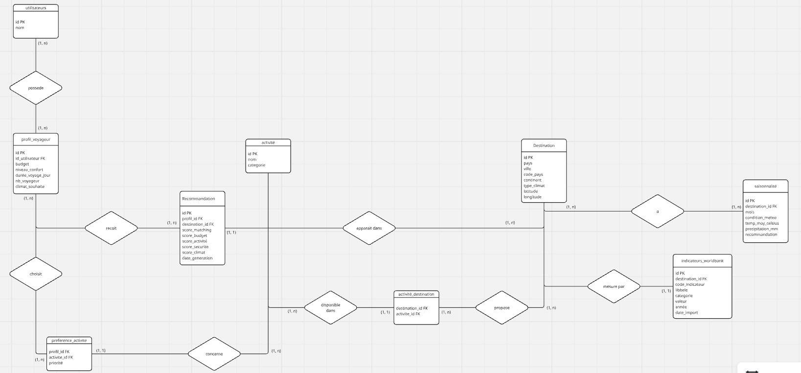
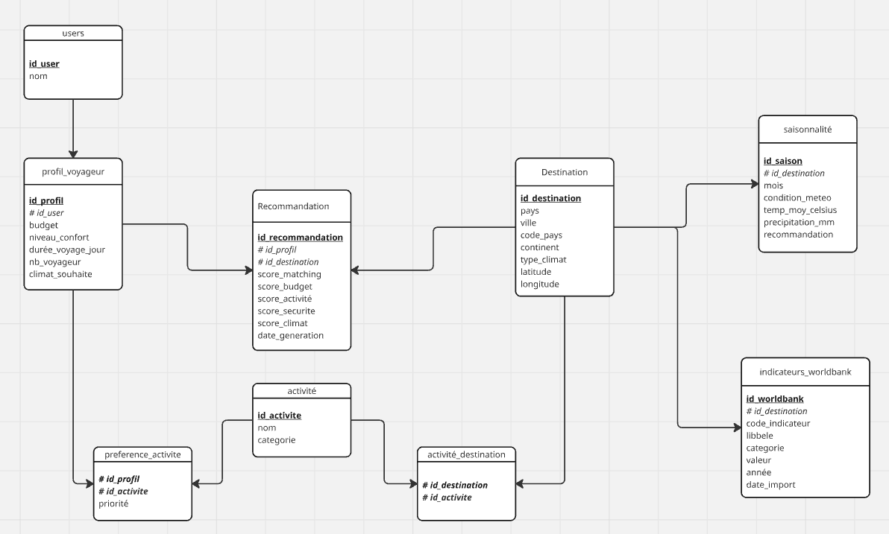
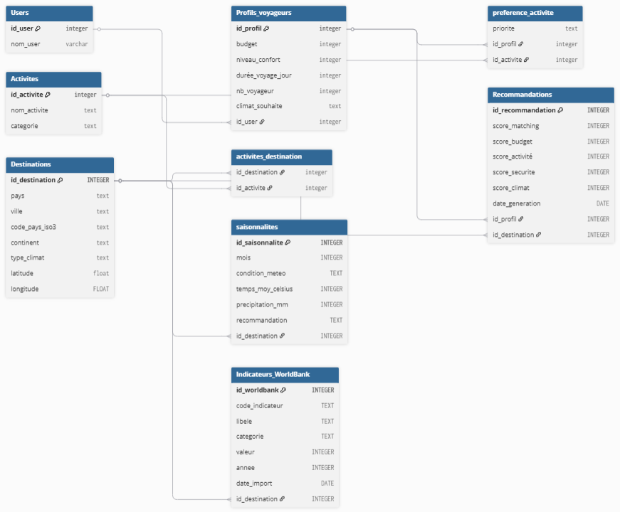

# Projet de certification - Recommandation de destination (ML)


<h2 align="center">🛠️ Technologies utilisées</h2>

<p align="center">
  
  
  
  
  
  

</p>


<details>
  <summary><strong><h1> Avancé du projet</h1></strong></summary>

<br>

### **SEMAINE 1**
- [x] Choix du projet individuel (sujet IA)
- [x] Redaction des specs fonctionnelles
- [x] User stories + backlog
- [x] Modelisation donnees (Merise)
- [x] Setup environnement agile
- [x] Choix architecture (n-tiers, micro-services...)

### **SEMAINE 2**
- [x] Extraction depuis API REST (ex: OpenWeather, HuggingFace)
- [x] Scraping web (BeautifulSoup/Scrapy)
- [x] Lecture fichiers (CSV, JSON, Parquet)
- [x] Connexion Big Data ou BDD externe
- [x] Nettoyage + agregation des donnees
- [x] Versionnement des scripts


### **SEMAINE 3**
- [x] Modelisation physique de la BDD (Merise)
- [x] Creation de la BDD (PostgreSQL/MySQL)
- [x] Script d'import des donnees
- [ ] RGPD : registre des traitements
- [ ] Dev API REST pour exposer les donnees
- [ ] Auth + securite API (OWASP)
- [ ] Documentation OpenAPI/Swagger

### **SEMAINE 4**	
- [ ] Organisation de la veille (sources, outils, frequence)
- [ ] Identification des services IA existants
  (Azure AI, OpenAI, HuggingFace, etc.)
- [ ] Benchmark compare des services
- [ ] Analyse eco-responsable
- [ ] Synthese et recommandations
- [ ] Communication aux parties prenantes

###  **SEMAINE 5**
- [ ] Installation et configuration du service IA retenu
- [ ] Parametrage selon la doc technique
- [ ] Creation de l'environnement d'execution
- [ ] Configuration du monitorage du service
- [ ] Test de faisabilite
- [ ] Documentation d'integration

###  **SEMAINE 6**
- [ ] Dev API REST exposant le modele/service IA
- [ ] Architecture REST, auth, securite OWASP
- [ ] Integration du modele dans l'API
- [ ] Dev application prototype (Streamlit/Gradio/Flask)
- [ ] Integration front-end avec l'API IA
- [ ] Tests d'integration

###  **SEMAINE 7** 	
- [ ] Definition des metriques du modele
- [ ] Integration outils de monitoring (MLflow, Grafana)
- [ ] Collecte + alertes sur les metriques
- [ ] Dev tests automatises du modele
  (donnees, entrainement, evaluation)
- [ ] Couverture de test documentee

###  **SEMAINE 8**	
- [ ] Creation chaine CI/CD pour le modele
- [ ] Automatisation : test donnees → entrainement → eval → packaging
- [ ] Integration des declencheurs
- [ ] Versionnement modele + donnees (DVC)
- [ ] Documentation de la chaine complete

###  **SEMAINE 9**
- [ ] Dev des composants techniques de l'app
- [ ] Integration des interfaces (front-end)
- [ ] Connexion avec l'API IA
- [ ] Gestion des droits et acces
- [ ] Securisation (OWASP top 10)
- [ ] Tests unitaires + integration
- [ ] Accessibilite (WCAG/RG2AA)

###  **SEMAINE 10**
- [ ] Chaine CI (tests auto, lint, build)
- [ ] Chaine CD (packaging, deploy staging)
- [ ] Variables d'environnement, configs
- [ ] Documentation des procedures
- [ ] Test de la chaine complete

###  **SEMAINE 11**
- [ ] Mise en place monitoring applicatif
  (Prometheus, Grafana, ELK...)
- [ ] Journalisation (logging structure)
- [ ] Definition seuils + alertes
- [ ] Simulation d'un incident technique
- [ ] Debug, resolution, documentation
- [ ] Feedback loop MLOps

###  **SEMAINE 12**
- [ ] Finalisation de tous les livrables
- [ ] Redaction du rapport professionnel
- [ ] Relecture croisee entre apprenants
- [ ] Verification couverture de toutes les competences
- [ ] Nettoyage des depots Git

###  **SEMAINE 13** 	
- [ ] Preparation du support de presentation
- [ ] Soutenances blanches (15-20 min)
- [ ] Feedback + ameliorations
- [ ] Preparation aux questions du jury
- [ ] Demo technique fonctionnelle

</details>

## 📌 Présentation

Mon projet est une application basée sur le machine learning qui analyse le profil des voyageurs pour recommander des destinations adaptées. Elle prend en compte les préférences, le budget et le style de voyage. Elle permet aussi d’identifier des destinations sous-cotées, moins connues mais intéressantes.

---

## 🧭 Architecture des données

### 🔹 MCD


### 🔹 MLD


### 🔹 MPD


#### 🗄️ Base de données : `BDD_Projet_Certif`

**Tables principales :**

- **Users**
  - id_user (PK)
  - nom_user

- **Destination**
  - id_destination (PK)
  - pays, ville, continent
  - climat, latitude, longitude

- **Activites**
  - id_activite (PK)
  - nom, catégorie

- **Profils_voyageurs**
  - budget
  - niveau_confort
  - durée_voyage
  - climat_souhaité

- **Recommandations**
  - score_matching
  - score_budget
  - score_activité
  - score_climat

---

## 📊 Sources de données

### 📁 Kaggle

- ~~[Travel Destinations](https://www.kaggle.com/datasets/leondesilva1/travel-destinations)~~ 
⚠️ Dataset non utilisé finalement.

- [Worldwide Travel Cities](https://www.kaggle.com/datasets/furkanima/worldwide-travel-cities-ratings-and-climate)  
✔️ Dataset principal :
- 560 villes
- Climat
- Budget
- Scores (culture, nature, etc.)

---

### 🌐 API

- [World Bank Data API](https://data360.worldbank.org/en/api)

---

### 🕸️ Web Scraping

- [Qualité de vie - Numbeo](https://fr.numbeo.com/qualit%C3%A9-de-vie/classements-par-pays?title=2024-mid)
- [Codes ISO 3166](https://www.sirius-upvm.net/doc/usuels/iso3166.html)


---
---
# **MISE à JOUR DE LA BASE DE DONNéES**
---
---
```sql
TABLE Users (
    id_user INTEGER PRIMARY KEY AUTOINCREMENT,
    nom_user TEXT
);
            
TABLE Profils_voyageurs(
    id_profil INTEGER PRIMARY KEY AUTOINCREMENT,
    budget INTEGER,
    niveau_confort INTEGER,
    durée_voyage_jour INTEGER,
    nb_voyageur INTEGER,
    temperature_souhaite TEXT,
    id_user INTEGER,
    FOREIGN KEY(id_user)
    REFERENCES Users(id_user)
);

TABLE Activites(
    id_activite INTEGER PRIMARY KEY AUTOINCREMENT,
    nom_activite TEXT
);

TABLE Destinations(
    id_destination INTEGER PRIMARY KEY AUTOINCREMENT,
    country TEXT,
    City TEXT,
    code_3L TEXT,
    region TEXT,
    short_description TEXT,
    latitude FLOAT,
    longitude FLOAT
);

TABLE preference_activite(
    priorite TEXT,
    id_profil INTEGER,
    id_activite INTEGER,
    FOREIGN KEY(id_profil)
    REFERENCES Profils_voyageurs(id_profil),
    FOREIGN KEY(id_activite)
    REFERENCES Activites(id_activite)
);

TABLE Recommandations(
    id_recommandation INTEGER PRIMARY KEY AUTOINCREMENT,
    score_matching INTEGER,
    score_budget INTEGER,
    score_activité INTEGER,
    score_securite INTEGER,
    score_climat INTEGER,
    date_generation DATE,
    id_profil INTEGER,
    id_destination INTEGER, 
    FOREIGN KEY(id_profil)
    REFERENCES Profils_voyageurs(id_profil),
    FOREIGN KEY(id_destination)
    REFERENCES Destinations(id_destination)
);

TABLE activites_destination(
    id_destination INTEGER,
    id_activite INTEGER,
    FOREIGN KEY(id_destination)
    REFERENCES Destinations(id_destination),
    FOREIGN KEY(id_activite)
    REFERENCES Activites(id_activite)
);

TABLE meteo(
    id_meteo INTEGER PRIMARY KEY AUTOINCREMENT,
    country TEXT,
    code_3L TEXT,
    City TEXT,
    month INTEGER,
    temp_avg FLOAT,
    temp_min FLOAT,
    temp_max FLOAT,
    id_destination INTEGER,
    FOREIGN KEY (id_destination)
    REFERENCES Destinations(id_destination)

);

TABLE Indicateurs_WorldBank(
    id_worldbank INTEGER PRIMARY KEY,
    code_indicateur TEXT,
    libele TEXT,
    categorie TEXT,
    valeur INTEGER,
    annee INTEGER,
    date_import DATE,
    code_3L TEXT,
    FOREIGN KEY(code_3L) 
    REFERENCES Destinations(code_3L)
); 
```


these <mark>very important words</mark>


| Syntax | Description |
| ----------- | ----------- |
| Header | Title |
| Paragraph | Text |