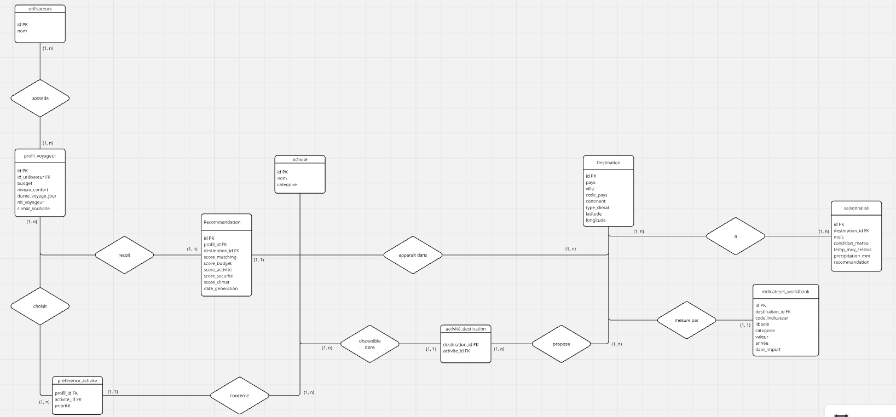
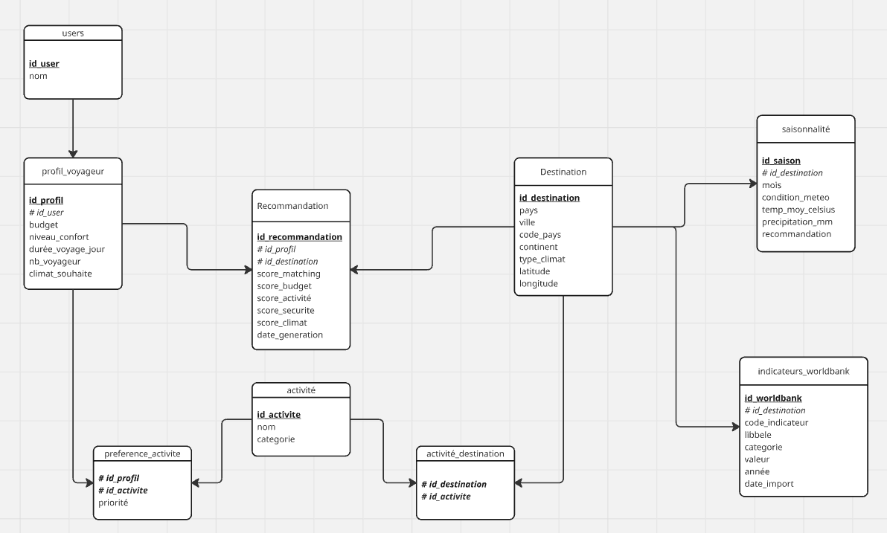
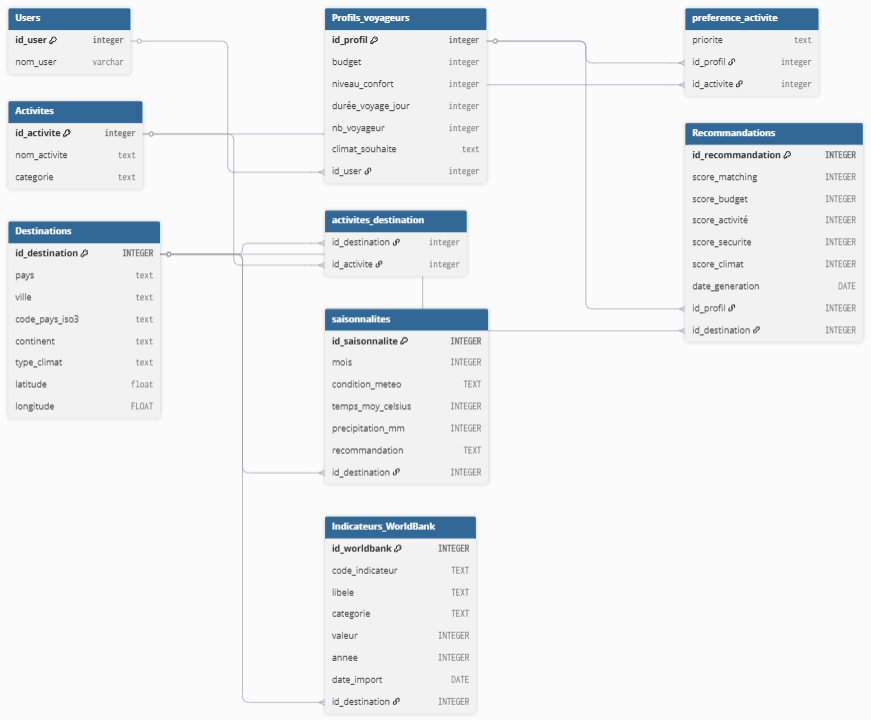

<div align="center">

# TravelMatch ✈️

**Moteur de recommandation de destinations de voyage basé sur le Machine Learning**

*Projet de certification — Développeur en Intelligence Artificielle*

---

[](https://github.com/silener/ProjetCertif/actions/workflows/ci.yml)
[](https://github.com/silener/ProjetCertif/actions/workflows/cd-docker.yml)


</div>

---

## Présentation

TravelMatch est une application web complète qui analyse le profil d'un voyageur (préférences, budget, température souhaitée, centres d'intérêt) pour lui recommander des destinations adaptées parmi plus de 500 villes mondiales. Le moteur de recommandation repose sur un pipeline ML complet : clustering non supervisé des destinations par archétype, puis scoring personnalisé en temps réel.

**Fonctionnalités principales :**
- Recommandation de destinations personnalisée par mois et préférences
- Score de matching affiché pour chaque destination (0–100 %)
- Système de favoris et d'historique de recherche par utilisateur
- Interface d'administration avec analytics (top destinations, activité, etc.)
- Authentification sécurisée JWT avec contrôle d'accès par rôle (user / admin)
- Monitoring temps réel du modèle IA (dérive de score, distribution des clusters)

---

## Architecture

```
┌─────────────┐     HTTP/REST      ┌─────────────────────────┐
│  Streamlit  │ ─────────────────► │     FastAPI Backend      │
│  (Frontend) │                    │  ┌────────────────────┐  │
│  port 8501  │ ◄───────────────── │  │  Moteur ML         │  │
└─────────────┘     JSON           │  │  KMeans + RF       │  │
                                   │  └────────────────────┘  │
                                   │  port 8000 (8001 Docker) │
                                   └──────────┬──────────────┘
                                              │
                        ┌─────────────────────┼─────────────────────┐
                        │                     │                     │
               ┌────────▼──────┐   ┌──────────▼──────┐   ┌────────▼───────┐
               │  PostgreSQL   │   │     MLflow       │   │   Prometheus   │
               │  port 5433    │   │   Experiment     │   │  + Grafana     │
               │  (via Docker) │   │   Tracking       │   │  port 9090/3000│
               └───────────────┘   │   port 5000      │   └────────────────┘
                                   └──────────────────┘
```

### Diagrammes de données

| MCD | MLD | MPD |
|-----|-----|-----|
|  |  |  |

---

## Stack technique

| Couche | Technologie | Rôle |
|--------|-------------|------|
| **Frontend** | Streamlit 1.32+, Plotly | Interface utilisateur interactive |
| **Backend** | FastAPI, Uvicorn | API REST — logique métier |
| **Base de données** | PostgreSQL 15, SQLAlchemy | Persistance des données |
| **Machine Learning** | scikit-learn, XGBoost, LightGBM | Clustering + Classification |
| **Experiment tracking** | MLflow | Suivi des entraînements, artefacts |
| **Monitoring** | Prometheus, Grafana | Métriques applicatives et modèle |
| **Authentification** | PyJWT (HS256) | Tokens Bearer — RBAC user/admin |
| **Conteneurisation** | Docker, Docker Compose | Déploiement multi-services |
| **CI/CD** | GitHub Actions | Tests automatisés + build Docker Hub |
| **Tests** | pytest, TestClient | Routes API, qualité données, scoring |

---

## Structure du projet

```
ProjetCertif/
├── backend/
│   ├── app_api.py          # Routes FastAPI (ordre CRUD : POST → GET → PUT → DELETE)
│   ├── database.py         # Modèles SQLAlchemy + fonctions BDD
│   ├── security.py         # JWT : create_token, get_current_user, require_admin
│   ├── config.py           # Variables d'environnement
│   └── scripts/
│       └── DB_CONFIG.py    # Configuration connexion PostgreSQL
├── frontend/
│   ├── app.py              # Application Streamlit principale
│   ├── auth.py             # Login / Register / auth_headers()
│   └── admin.py            # Panneau d'administration
├── mlops/
│   ├── train.py            # Entraînement RandomForest + benchmark classifieurs
│   └── mlflow_utils.py     # Helpers artefacts MLflow (heatmap, ROC, learning curve…)
├── tests/
│   ├── test_api_routes.py      # 16 tests routes FastAPI (JWT mocké)
│   ├── test_data_quality.py    # 9 tests qualité du dataset
│   ├── test_scoring_regression.py  # 6 tests invariants mathématiques du scoring
│   └── test_db.py              # Tests connexion et structure PostgreSQL
├── DATA/
│   └── processed/
│       └── data_clean.csv  # Dataset principal (~500 villes × 12 mois)
├── docs/
│   └── incidents/          # Captures et rapports d'incidents de monitoring
├── grafana/
│   └── provisioning/       # Dashboards Grafana pré-configurés
├── .github/
│   └── workflows/
│       ├── ci.yml          # CI : pytest sur push main/develop
│       └── cd-docker.yml   # CD : build & push Docker Hub sur push main
├── recommender.py          # Moteur de scoring et cache ML
├── budget_categorizer.py   # Catégorisation du budget (4 niveaux)
├── docker-compose.yml      # Orchestration des 7 services
├── prometheus.yml          # Configuration scraping Prometheus
├── requirements.txt        # Dépendances Python
├── .env.example            # Template des variables d'environnement
└── README.md
```

---

## Prérequis

- **Docker Desktop** ≥ 24 (recommandé — lance tous les services en une commande)
- *ou* Python 3.13 + PostgreSQL 15 pour un déploiement local sans Docker

---

## Installation

### Option 1 — Docker Compose (recommandé)

```bash
# 1. Cloner le dépôt
git clone https://github.com/silener/ProjetCertif.git
cd ProjetCertif

# 2. Créer le fichier de configuration à partir du template
cp .env.example .env
# Éditer .env avec vos valeurs (voir section Configuration ci-dessous)

# 3. Lancer tous les services
docker compose up --build -d

# 4. Vérifier que tout est démarré
docker compose ps
```

Les services démarrent dans cet ordre : PostgreSQL → Backend → Frontend + MLflow + Prometheus + Grafana.

### Option 2 — Environnement local (sans Docker)

```bash
# 1. Cloner le dépôt
git clone https://github.com/silener/ProjetCertif.git
cd ProjetCertif

# 2. Créer un environnement virtuel
python -m venv .venv
source .venv/bin/activate        # Linux/Mac
.venv\Scripts\activate           # Windows

# 3. Installer les dépendances
pip install -r requirements.txt

# 4. Configurer les variables d'environnement
cp .env.example .env
# Éditer .env avec vos valeurs

# 5. Lancer le backend FastAPI
uvicorn backend.app_api:app --reload --port 8000

# 6. Lancer le frontend Streamlit (dans un second terminal)
streamlit run frontend/app.py
```

> PostgreSQL doit être installé et démarré localement avec les credentials de votre `.env`.

---

## Configuration

Copiez `.env.example` vers `.env` et renseignez les valeurs :

```env
# ── Base de données PostgreSQL ───────────────────────────────────────────
DB_USER=user
DB_PASSWORD=votre_mot_de_passe_db
DB_NAME=bdd_projet_certif

# ── Sécurité JWT ────────────────────────────────────────────────────────
# Générer avec : python -c "import secrets; print(secrets.token_hex(32))"
SECRET_KEY=votre_cle_secrete_longue_et_aleatoire

# ── API Pexels (photos de destinations) ────────────────────────────────
PEXELS_API_KEY=votre_cle_pexels

# ── PgAdmin ─────────────────────────────────────────────────────────────
PGADMIN_EMAIL=admin@example.com
PGADMIN_PASSWORD=votre_mot_de_passe_pgadmin

# ── Grafana ──────────────────────────────────────────────────────────────
GRAFANA_ADMIN_PASSWORD=votre_mot_de_passe_grafana
```

> Le fichier `.env` est ignoré par git (voir `.gitignore`). Ne le commitez jamais.

---

## Accès aux services

| Service | URL locale | Identifiants par défaut |
|---------|-----------|------------------------|
| **Application** (Streamlit) | http://localhost:8501 | Créer un compte via l'interface |
| **API** (Swagger UI) | http://localhost:8001/docs | — |
| **MLflow** | http://localhost:5000 | — |
| **Grafana** | http://localhost:3000 | `admin` / valeur de `GRAFANA_ADMIN_PASSWORD` |
| **PgAdmin** | http://localhost:5050 | Valeurs `PGADMIN_EMAIL` / `PGADMIN_PASSWORD` |
| **Prometheus** | http://localhost:9090 | — |

---

## API — Endpoints principaux

L'API est documentée automatiquement par FastAPI : **http://localhost:8001/docs**

Les routes sont organisées en ordre CRUD (Create → Read → Update → Delete) :

### Create (POST)
| Route | Auth | Description |
|-------|------|-------------|
| `POST /auth/register` | Public | Créer un compte |
| `POST /auth/login` | Public | Obtenir un token JWT |
| `POST /recommendations` | User | Obtenir des recommandations |
| `POST /favorites` | User | Ajouter un favori |

### Read (GET)
| Route | Auth | Description |
|-------|------|-------------|
| `GET /` | Public | Healthcheck |
| `GET /budget/info` | Public | Catégories de budget disponibles |
| `GET /users/{id}/interests` | User (owner) | Centres d'intérêt d'un utilisateur |
| `GET /favorites` | User (owner) | Liste des favoris |
| `GET /history` | User (owner) | Historique de recherche |
| `GET /model/metrics` | Admin | Métriques temps réel du modèle IA |
| `GET /api/admin/stats` | Admin | Statistiques globales |
| `GET /api/admin/users` | Admin | Liste des utilisateurs |

### Update (PUT)
| Route | Auth | Description |
|-------|------|-------------|
| `PUT /users/{id}/interests` | User (owner) | Mettre à jour les préférences |

### Delete (DELETE)
| Route | Auth | Description |
|-------|------|-------------|
| `DELETE /favorites` | User (owner) | Supprimer un favori |
| `DELETE /api/admin/users/{id}` | Admin | Supprimer un compte |

**Authentification :** toutes les routes protégées attendent un header `Authorization: Bearer <token>`.

---

## Pipeline Machine Learning

### 1. Clustering des destinations (non supervisé)

```
data_clean.csv (500+ villes × 12 mois)
        │
        ▼
MinMaxScaler → KMeans (k=6, choix par elbow + silhouette)
        │
        ▼
6 archétypes : Nature / Patrimoine / Festif / Gastronomie / Détente / Aventure
```

### 2. Scoring en temps réel

Pour chaque requête utilisateur, le moteur calcule un score (0–100) par destination :

```python
score = (
    poids_temperature × similarite_temp     # 25 %
  + poids_activites  × matching_activites   # 30 %
  + poids_cluster    × bonus_cluster        # 20 %
  + poids_budget     × compatibilite_budget # 15 %
  + poids_qualite    × indice_qualite_vie   # 10 %
)
```

### 3. Entraînement MLOps

```bash
# Lancer un entraînement complet avec tracking MLflow
python mlops/train.py
```

Le script :
- Benchmark plusieurs classifieurs (RandomForest, XGBoost, LightGBM)
- Optimise via `RandomizedSearchCV` + `StratifiedKFold`
- Logue dans MLflow : métriques, paramètres, artefacts (classification report heatmap, courbes ROC, learning curve, matrice de confusion, importance des variables)
- Enregistre le meilleur modèle dans le Model Registry MLflow

---

## Tests

```bash
# Lancer tous les tests
pytest tests/ -v

# Par fichier
pytest tests/test_api_routes.py -v      # Tests routes HTTP
pytest tests/test_data_quality.py -v    # Tests qualité données
pytest tests/test_scoring_regression.py -v  # Tests scoring ML
pytest tests/test_db.py -v              # Tests base de données
```

| Fichier | Couverture |
|---------|-----------|
| `test_api_routes.py` | 16 tests — contrat HTTP, codes de statut, JWT mocké |
| `test_data_quality.py` | 9 tests — structure CSV, complétude, plages de valeurs |
| `test_scoring_regression.py` | 6 tests — invariants mathématiques du scoring |
| `test_db.py` | Tests connexion PostgreSQL et structure des tables |

---

## CI/CD

### CI — GitHub Actions (`ci.yml`)

Déclenché sur chaque push vers `main` ou `develop` :

1. Démarrage d'un service PostgreSQL 15
2. Installation des dépendances Python
3. Initialisation du schéma de base de données
4. Exécution de la suite de tests `pytest`

### CD — GitHub Actions (`cd-docker.yml`)

Déclenché sur chaque push vers `main` :

1. Build de l'image Docker backend (`FastAPI`)
2. Build de l'image Docker frontend (`Streamlit`)
3. Push vers Docker Hub (`silener/projetcertif-backend:latest`, `silener/projetcertif-frontend:latest`)

**Secrets GitHub à configurer** (`Settings → Secrets and variables → Actions`) :

| Secret | Description |
|--------|-------------|
| `DB_USER` | Utilisateur PostgreSQL |
| `DB_PASSWORD` | Mot de passe PostgreSQL |
| `DOCKER_USERNAME` | Identifiant Docker Hub |
| `DOCKER_PASSWORD` | Mot de passe / token Docker Hub |
| `GRAFANA_ADMIN_PASSWORD` | Mot de passe admin Grafana |
| `PGADMIN_EMAIL` | Email PgAdmin |
| `PGADMIN_PASSWORD` | Mot de passe PgAdmin |

---

## Monitoring

### Prometheus

Collecte automatiquement les métriques HTTP (via `prometheus-fastapi-instrumentator`) et les métriques métier du modèle IA :

| Métrique | Type | Description |
|----------|------|-------------|
| `travelmatch_recommandations_total` | Counter | Nombre d'appels à `/recommendations` |
| `travelmatch_score_moyen_matching` | Gauge | Score moyen des recommandations (signal de dérive) |
| `travelmatch_score_min_matching` | Gauge | Score minimum des recommandations |
| `travelmatch_cluster_recommande_total` | Counter | Distribution des clusters recommandés |

### Grafana

Dashboard pré-configuré accessible sur http://localhost:3000 — visualise la latence des routes, le taux d'erreur HTTP et les métriques du modèle IA.

Captures d'incidents documentées dans [`docs/incidents/`](docs/incidents/).

---

## Sources de données

| Source | Type | Contenu |
|--------|------|---------|
| [Worldwide Travel Cities (Kaggle)](https://www.kaggle.com/datasets/furkanima/worldwide-travel-cities-ratings-and-climate) | CSV | 560 villes, scores culturels, budget, climat |
| [World Bank Data API](https://data360.worldbank.org/en/api) | API REST | Indicateurs socio-économiques par pays |
| [Numbeo](https://fr.numbeo.com/qualité-de-vie/) | Web scraping | Indices qualité de vie par pays |
| [ISO 3166](https://www.sirius-upvm.net/doc/usuels/iso3166.html) | Web scraping | Codes pays ISO 3 lettres |

---

## Sécurité

- **JWT (HS256)** — tokens 24h, `SECRET_KEY` stockée dans `.env` uniquement
- **RBAC** — deux niveaux : `user` (accès à ses propres données) et `admin` (accès global)
- **Ownership checks** — un utilisateur ne peut accéder qu'à ses propres favoris, historique et préférences
- **Secrets** — aucun mot de passe dans le code ou le dépôt git (`.env` gitignored)
- **Données sensibles** — données brutes, bases SQLite locales et modèles ML sérialisés exclus du dépôt

---

## Auteur

**Silène Regat** — Projet de certification Développeur IA

---

<div align="center">

*Fait avec Python, beaucoup de café ☕ et quelques clusters KMeans*

</div>
